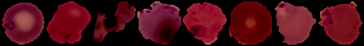
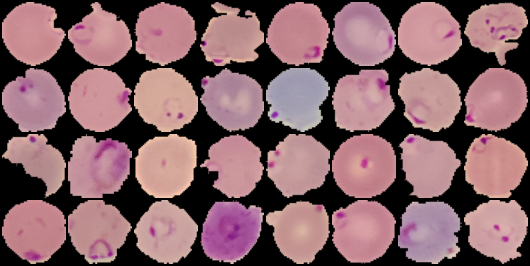
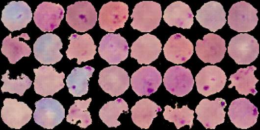

Deep neural networks are used mainly for supervised learning: classification or regression. Generative Adverserial Networks or GANs, however, use neural networks for a very different purpose: Generative modeling

Generative modeling is an unsupervised learning task in machine learning that involves automatically discovering and learning the regularities or patterns in input data in such a way that the model can be used to generate or output new examples that plausibly could have been drawn from the original dataset.

While there are many approaches used for generative modeling, a Generative Adverserial Network takes the following approach:

There are two neural networks: a Generator and a Discriminator. The generator generates a "fake" sample given a random vector/matrix, and the discriminator attempts to detect whether a given sample is "real" (picked from the training data) or "fake" (generated by the generator). Training happens in tandem: we train the discriminator for a few epochs, then train the generator for a few epochs, and repeat. This way both the generator and the discriminator get better at doing their jobs. This rather simple approach can lead to some astounding results.

# Generator

# Discriminator

# Key Points

DCGANS try to solve some of the above problems by using ConvNets in the Generator and Discriminator instead of simple MLP's. The authors in the paper also propose some architectual contraints on the ConvNets that helps stabilize GAN training. Some of these constraints are:

1. Using only convolutional layers in the Generator and the Discriminator by increasing the stride, therfore discouraging the use of MaxPooling and Dense layers in the ConvNet architecture.

2. Using BatchNormalization in both the Generator and the Discriminator during training.

3. The generator uses tanh activation in the final layer while the discriminator uses leaky-relu activation in all the layers.

# Augmentation

Real Images after applying Image Augmentation

# Results

This is the batch of some Real Images.

This is the batch of some Fake Images generated by DCGAN.

