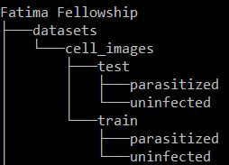

# Malaria Blood Cells

## Content
This is modified dataset for research project.

## The Directory Tree

The training folder contains **17021** images out of which **12480** are uninfected images and **4541** images are **parasitized** which makes dataset **Imbalanced**.

**Parasitized**

**Uninfected**

Download the original Dataset from [here](https://lhncbc.nlm.nih.gov/publication/pub9932).

## What is malaria??
Malaria is a serious and sometimes fatal disease caused by a parasite that commonly infects a certain type of mosquito which feeds on humans. People who get malaria are typically very sick with high fevers, shaking chills, and flu-like illness. Four kinds of malaria parasites infect humans: Plasmodium falciparum, P. vivax, P. ovale, and P. malariae. In addition, P. knowlesi, a type of malaria that naturally infects macaques in Southeast Asia, also infects humans, causing malaria that is transmitted from animal to human (“zoonotic” malaria). P. falciparum is the type of malaria that is most likely to result in severe infections and if not promptly treated, may lead to death. Although malaria can be a deadly disease, illness and death from malaria can usually be prevented. About 2,000 cases of malaria are diagnosed in the United States each year. The vast majority of cases in the United States are in travelers and immigrants returning from parts of the world where malaria transmission occurs, including sub-Saharan Africa and South Asia.

## How People Get Malaria (Transmission)?

Usually, people get malaria by being bitten by an infective female Anopheles mosquito. Only Anopheles mosquitoes can transmit malaria and they must have been infected through a previous blood meal taken from an infected person. When a mosquito bites an infected person, a small amount of blood is taken in which contains microscopic malaria parasites. About 1 week later, when the mosquito takes its next blood meal, these parasites mix with the mosquito’s saliva and are injected into the person being bitten. Because the malaria parasite is found in red blood cells of an infected person, malaria can also be transmitted through blood transfusion, organ transplant, or the shared use of needles or syringes contaminated with blood. Malaria may also be transmitted from a mother to her unborn infant before or during delivery (“congenital” malaria).

## Is malaria a contagious disease?

No. Malaria is not spread from person to person like a cold or the flu, and it cannot be sexually transmitted. You cannot get malaria from casual contact with malaria-infected people, such as sitting next to someone who has malaria.

## What are the signs and symptoms of malaria?

Symptoms of malaria include fever and flu-like illness, including shaking chills, headache, muscle aches, and tiredness. Nausea, vomiting, and diarrhea may also occur. Malaria may cause anemia and jaundice (yellow coloring of the skin and eyes) because of the loss of red blood cells. If not promptly treated, the infection can become severe and may cause kidney failure, seizures, mental confusion, coma, and death.

## How soon will a person feel sick after being bitten by an infected mosquito?

For most people, symptoms begin 10 days to 4 weeks after infection, although a person may feel ill as early as 7 days or as late as 1 year later. Two kinds of malaria, P. vivax and P. ovale, can occur again (relapsing malaria). In P. vivax and P. ovale infections, some parasites can remain dormant in the liver for several months up to about 4 years after a person is bitten by an infected mosquito. When these parasites come out of hibernation and begin invading red blood cells (“relapse”), the person will become sick.
